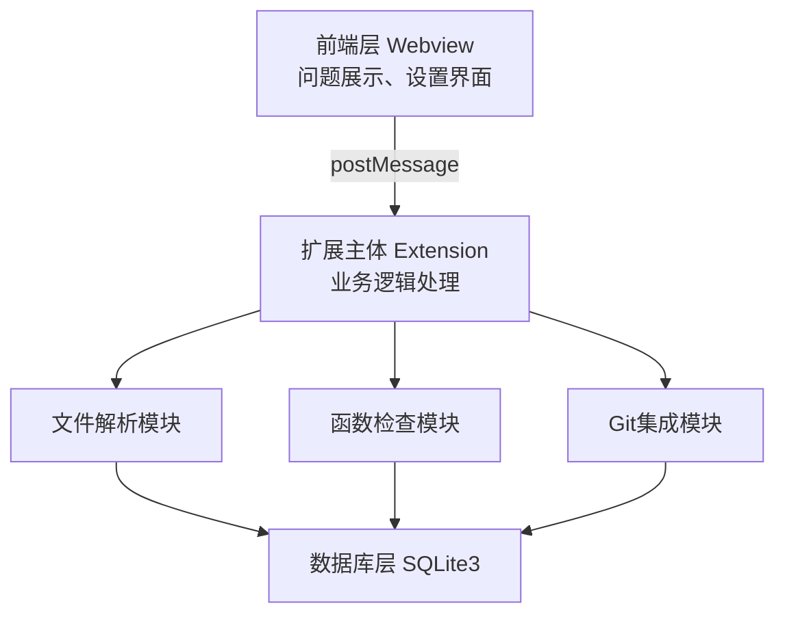
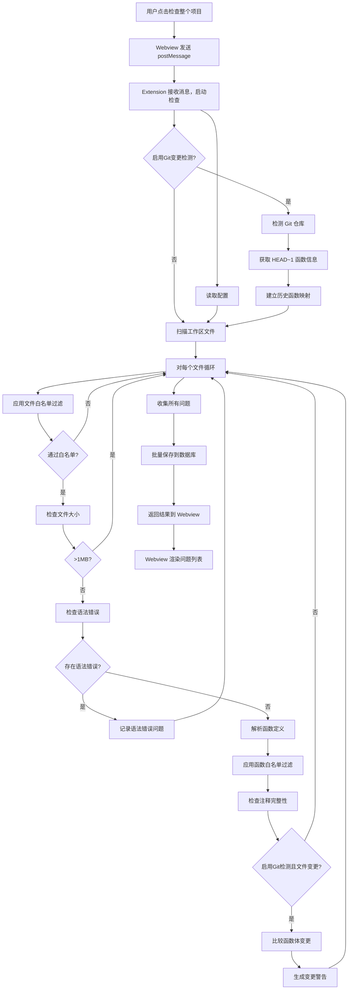
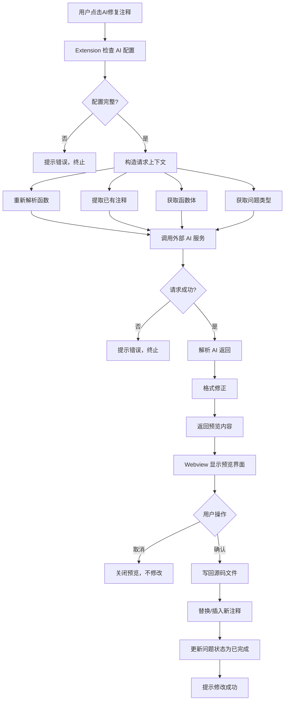

# Doc-Doctor 系统原型报告

## 1. 报告概述

### 1.1 系统简介

**Doc-Doctor** 是一款运行于 Visual Studio Code 的扩展插件，专门用于自动检测 C/C++ 项目中函数注释的完整性问题。系统通过静态代码分析技术，识别缺失的参数说明、返回值说明、函数功能描述等常见文档问题，并提供 AI 辅助生成注释的能力。

### 1.2 原型验证范围

本原型重点验证以下关键技术点：

1. **C/C++ 函数解析技术**：使用正则表达式提取函数定义和注释的可行性
2. **Doxygen 注释检查规则**：注释完整性检查的准确性
3. **VS Code Webview 通信机制**：前后端消息传递的可靠性
4. **SQLite 数据持久化**：通过 FFI 调用 C++ 动态库的可行性
5. **Git 集成**：基于 Git 历史检测函数变更的可行性
6. **AI 服务集成**：外部 AI 服务调用和注释生成的可行性

---

## 2. 关键技术验证

### 2.1 C/C++ 函数解析验证

**验证目标**：验证使用正则表达式解析 C/C++ 函数定义的可行性。

**验证方法**：
- 使用正则表达式匹配函数定义模式
- 提取函数签名、函数名、参数列表
- 向上搜索函数前的注释块
- 计算函数位置（行号、列号）

**验证结果**：
- **基本可行**：正则表达式能够识别大部分标准 C/C++ 函数定义
- **限制发现**：
  - 无法准确解析 C++ 模板函数
  - 宏定义的函数可能无法正确识别
  - 匿名函数不在检查范围内
  - 复杂嵌套结构可能误匹配

**建议**：
- 当前阶段使用正则表达式方案，满足基本需求
- 后续可考虑引入轻量级语法解析器（如 Tree-sitter）提升准确性

### 2.2 Doxygen 注释检查规则验证

**验证目标**：验证注释完整性检查规则的准确性。

**验证方法**：
- 解析 Doxygen 注释块（`/** ... */`）
- 检查 `@brief`、`@param`、`@return` 标签的存在性
- 匹配函数参数与 `@param` 标签的对应关系

**验证结果**：
- **规则可行**：能够准确识别注释缺失问题
- **检查准确性**：能够正确区分不同类型的注释缺失
- **边界情况**：
  - 注释格式存在但内容为空时，视为缺失
  - 参数名与 `@param` 标签不完全匹配时可能误判

**建议**：
- 采用当前检查规则，满足基本需求
- 在实现中增加注释内容有效性验证

### 2.3 VS Code Webview 通信机制验证

**验证目标**：验证前后端通过 postMessage 通信的可靠性。

**验证方法**：
- 实现 Webview 与 Extension 之间的消息传递
- 测试异步消息处理的稳定性
- 验证大数据量传输的可行性

**验证结果**：
- **通信机制可靠**：postMessage 机制稳定可用
- **异步处理正常**：能够正确处理异步操作
- **性能考虑**：
  - 单次消息传输数据量建议控制在合理范围（< 1MB）
  - 大量问题记录需要分批传输或采用分页加载

**建议**：
- 采用 postMessage 机制实现前后端通信
- 问题列表采用分页或虚拟滚动优化性能

### 2.4 SQLite 数据持久化验证

**验证目标**：验证通过 FFI 调用 C++ 动态库操作 SQLite 的可行性。

**验证方法**：
- 使用 koffi 库实现 TypeScript 与 C++ DLL 的 FFI 调用
- 实现数据库初始化、插入、查询、更新操作
- 测试跨语言数据序列化（JSON）

**验证结果**：
- **FFI 调用可行**：koffi 库能够稳定调用 C++ 函数
- **数据序列化正常**：JSON 格式能够正确传递复杂数据结构
- **技术复杂度**：
  - 需要维护 TypeScript 和 C++ 两套代码
  - 跨语言错误处理需要额外考虑
  - 调试相对复杂

**替代方案评估**：
- **方案 A（当前）**：TypeScript + C++ DLL + SQLite
  - 优点：性能好，原生 SQLite 支持完整
  - 缺点：技术栈复杂，维护成本高
- **方案 B**：纯 TypeScript + better-sqlite3
  - 优点：技术栈统一，开发调试简单
  - 缺点：需要 Node.js 原生模块，可能存在兼容性问题

**建议**：
- 当前采用方案 A，已验证技术可行性
- 若后续发现维护成本过高，可考虑迁移到方案 B

### 2.5 Git 集成验证

**验证目标**：验证基于 Git 历史检测函数变更的可行性。

**验证方法**：
- 使用 VS Code Git 扩展 API 访问 Git 仓库
- 获取 `HEAD~1` 版本的函数信息
- 比较当前版本与历史版本的函数体差异
- 识别实质性变更（忽略空白和注释）

**验证结果**：
- **Git API 可用**：VS Code Git 扩展 API 能够访问仓库信息
- **变更检测可行**：能够识别函数体的实质性变更
- **前置条件**：
  - 需要工作区为 Git 仓库
  - 需要至少两条提交记录（确保 `HEAD~1` 可用）
  - Git 不可用时需要优雅降级

**建议**：
- 实现 Git 变更检测功能
- 在配置中提供开关，允许用户禁用
- 非 Git 仓库或历史不足时，跳过检测并给出提示

### 2.6 AI 服务集成验证

**验证目标**：验证外部 AI 服务调用和注释生成的可行性。

**验证方法**：
- 构造 AI 请求上下文（函数源码、已有注释、问题类型）
- 调用外部 AI 服务（HTTP POST）
- 解析 AI 返回的注释内容
- 进行格式修正和验证

**验证结果**：
- **服务调用可行**：标准 HTTP 接口能够正常调用
- **注释生成质量**：AI 生成的注释基本符合 Doxygen 规范
- **需要格式修正**：AI 返回的注释可能需要后处理以确保格式正确
- **隐私和安全**：
  - 需要明确告知用户数据发送范围
  - API Key 需要使用 SecretStorage 加密存储
  - 默认关闭，需用户手动启用

**建议**：
- 实现 AI 辅助功能，但默认关闭
- 在设置界面和文档中明确说明隐私政策
- 实现注释格式自动修正机制

---

## 3. 技术选型验证

### 3.1 前端技术选型

**选型**：VS Code Webview + HTML/CSS/JavaScript + Webview UI Toolkit

**验证结果**：
- **Webview 可用**：VS Code Webview API 功能完善
- **UI Toolkit 支持**：提供标准化组件，开发效率高
- **样式隔离**：Webview 运行在隔离环境中，样式不会冲突

**建议**：采用当前技术选型

### 3.2 后端技术选型

**选型**：TypeScript + Node.js (VS Code Extension Host)

**验证结果**：
- **扩展开发成熟**：VS Code 扩展开发生态完善
- **TypeScript 类型安全**：提供良好的类型检查和开发体验
- **API 丰富**：VS Code API 覆盖文件系统、编辑器、Git 等需求

**建议**：采用当前技术选型

### 3.3 数据存储选型

**选型**：SQLite3 + C++ DLL + koffi FFI

**验证结果**：
- **性能良好**：SQLite 轻量级，性能满足需求
- **FFI 调用可行**：koffi 库稳定可用
- **技术复杂度**：需要维护多语言代码

**替代方案**：better-sqlite3（纯 TypeScript）

**建议**：
- 当前采用 SQLite + C++ DLL 方案
- 若后续维护成本过高，可评估迁移到 better-sqlite3

### 3.4 构建工具选型

**选型**：npm (TypeScript) + CMake (C++)

**验证结果**：
- **构建流程清晰**：TypeScript 编译和 C++ 构建分离
- **跨平台支持**：CMake 支持多平台构建
- **构建复杂度**：需要同时维护两套构建配置

**建议**：采用当前构建方案，在文档中提供详细的构建说明

---

## 4. 原型图

### 4.1 系统架构原型

系统采用前后端分离的分层架构：



### 4.2 用户界面原型

#### 4.2.1 检查页界面原型

```
┌─────────────────────────────────────┐
│  [检查] [设置]                       │
├─────────────────────────────────────┤
│  [检查整个项目]                      │
├─────────────────────────────────────┤
│  🔍 搜索...  [所有类型 ▼]            │
│                                     │
│  ┌───────────────────────────────┐  │
│  │ ○ add        参数缺失  行 25  │  │
│  │ src/math.c                   │  │
│  │ [AI修复注释]                  │  │
│  └───────────────────────────────┘  │
│                                     │
│  ┌───────────────────────────────┐  │
│  │ ○ calculate  返回值缺失 行 42 │  │
│  │ src/utils.c                   │  │
│  │ [AI修复注释]                  │  │
│  └───────────────────────────────┘  │
└─────────────────────────────────────┘
```

#### 4.2.2 设置页界面原型

```
┌─────────────────────────────────────┐
│  [检查] [设置]                       │
├─────────────────────────────────────┤
│  检查规则                            │
│  ☐ 检查 main 函数                    │
│  ☑ 启用 Git 变更警告                  │
├─────────────────────────────────────┤
│  AI 辅助功能                         │
│  ☐ 启用 AI 修复注释                   │
│  AI 服务地址: [输入框]                │
│  API Key: [输入框]                    │
├─────────────────────────────────────┤
│  文件白名单                          │
│  [多行文本框]                         │
├─────────────────────────────────────┤
│  函数白名单                          │
│  [多行文本框]                         │
├─────────────────────────────────────┤
│  [保存设置]                          │
└─────────────────────────────────────┘
```

#### 4.2.3 AI 修复预览界面原型

```
┌─────────────────────────────────────┐
│  AI 修复注释预览            [×]     │
├─────────────────────────────────────┤
│  函数: calculate @ src/utils.c:42   │
├─────────────────────────────────────┤
│  ┌────────────┐  ┌──────────────┐  │
│  │ 原始注释   │  │ AI生成注释    │  │
│  │ 无注释     │  │ /**          │  │
│  │            │  │  * @brief... │  │
│  │            │  │  */          │  │
│  └────────────┘  └──────────────┘  │
├─────────────────────────────────────┤
│  [取消]              [应用修改]      │
└─────────────────────────────────────┘
```

### 4.3 数据流程原型

#### 4.3.1 项目检查流程



#### 4.3.2 AI 修复流程



---

## 5. 原型实现的关键功能

### 4.1 已实现功能

原型阶段实现了以下核心功能，用于验证技术可行性：

1. **基础文件解析**：
   - 读取 C/C++ 源文件
   - 使用正则表达式提取函数定义
   - 提取函数前的注释块

2. **注释检查**：
   - 检查 `@brief`、`@param`、`@return` 标签
   - 生成问题记录

3. **Webview 通信**：
   - 实现前后端消息传递
   - 问题列表展示

4. **数据持久化**：
   - SQLite 数据库操作
   - FFI 调用验证

5. **基础 Git 集成**：
   - 获取 Git 历史信息
   - 函数变更检测

### 4.2 未实现功能（待设计阶段完善）

以下功能在原型中未完全实现，需要在设计阶段详细规划：

1. **完整的白名单系统**：文件、函数、返回类型白名单
2. **AI 辅助注释生成**：完整的 AI 服务集成和格式修正
3. **问题状态管理**：已完成状态的持久化和界面展示
4. **设置界面**：完整的配置管理界面
5. **性能优化**：大项目检查的性能优化策略

---

## 6. 验证结果总结

### 6.1 技术可行性结论

| 技术点 | 可行性 | 风险等级 | 备注 |
|--------|--------|---------|------|
| C/C++ 函数解析 | 可行 | 中 | 正则表达式方案基本满足需求，复杂场景有局限 |
| 注释检查规则 | 可行 | 低 | 规则清晰，实现简单 |
| Webview 通信 | 可行 | 低 | 机制成熟稳定 |
| SQLite + FFI | 可行 | 中 | 技术栈复杂，但已验证可行 |
| Git 集成 | 可行 | 低 | API 完善，需要处理边界情况 |
| AI 服务集成 | 可行 | 中 | 需要关注隐私和安全 |

### 6.2 关键技术发现

**发现 1：函数解析的局限性**
- 正则表达式方案无法处理所有 C/C++ 语法场景
- 建议：当前采用正则方案，后续可考虑引入语法解析器

**发现 2：数据持久化的技术复杂度**
- FFI 调用增加了开发和维护成本
- 建议：评估纯 TypeScript 方案的可行性作为备选

**发现 3：Git 集成的依赖**
- 功能依赖 Git 仓库和提交历史
- 建议：实现优雅降级，非 Git 场景不影响基础功能

**发现 4：AI 功能的隐私考虑**
- 需要明确数据发送范围和用户授权
- 建议：默认关闭，提供清晰的隐私说明

### 6.3 性能初步评估

基于原型测试的初步性能评估：

- **小规模项目**（< 100 文件）：检查时间 < 30 秒，性能良好
- **中等规模项目**（100-500 文件）：检查时间 30-120 秒，可接受
- **大规模项目**（> 500 文件）：需要优化策略，考虑增量检查或并行处理

---

## 7. 技术风险与限制

### 7.1 技术风险

1. **函数解析准确性风险**
   - **风险**：正则表达式可能误匹配或漏匹配
   - **影响**：可能产生误报或漏报
   - **缓解措施**：在实现中增加边界情况处理，后续考虑引入语法解析器

2. **跨语言调用稳定性风险**
   - **风险**：FFI 调用可能出现内存问题或崩溃
   - **影响**：可能导致扩展不稳定
   - **缓解措施**：充分的错误处理和测试，考虑纯 TypeScript 备选方案

3. **Git 依赖风险**
   - **风险**：非 Git 仓库或历史不足时功能受限
   - **影响**：部分功能不可用
   - **缓解措施**：实现优雅降级，确保基础功能不受影响

4. **AI 服务可用性风险**
   - **风险**：外部 AI 服务不可用或响应慢
   - **影响**：AI 功能不可用
   - **缓解措施**：提供超时和重试机制，确保不影响基础功能

### 7.2 已知限制

1. **文件类型支持**：当前仅支持 `.c` 和 `.cpp` 文件，不支持 `.h` 头文件独立检查
2. **函数解析限制**：不支持 C++ 模板函数、宏定义函数、匿名函数
3. **注释格式**：仅支持 Doxygen 风格注释
4. **性能限制**：单次检查最多返回 1,000 条问题，单个文件最大 1MB
5. **Git 依赖**：需要至少两条提交记录才能进行变更检测

