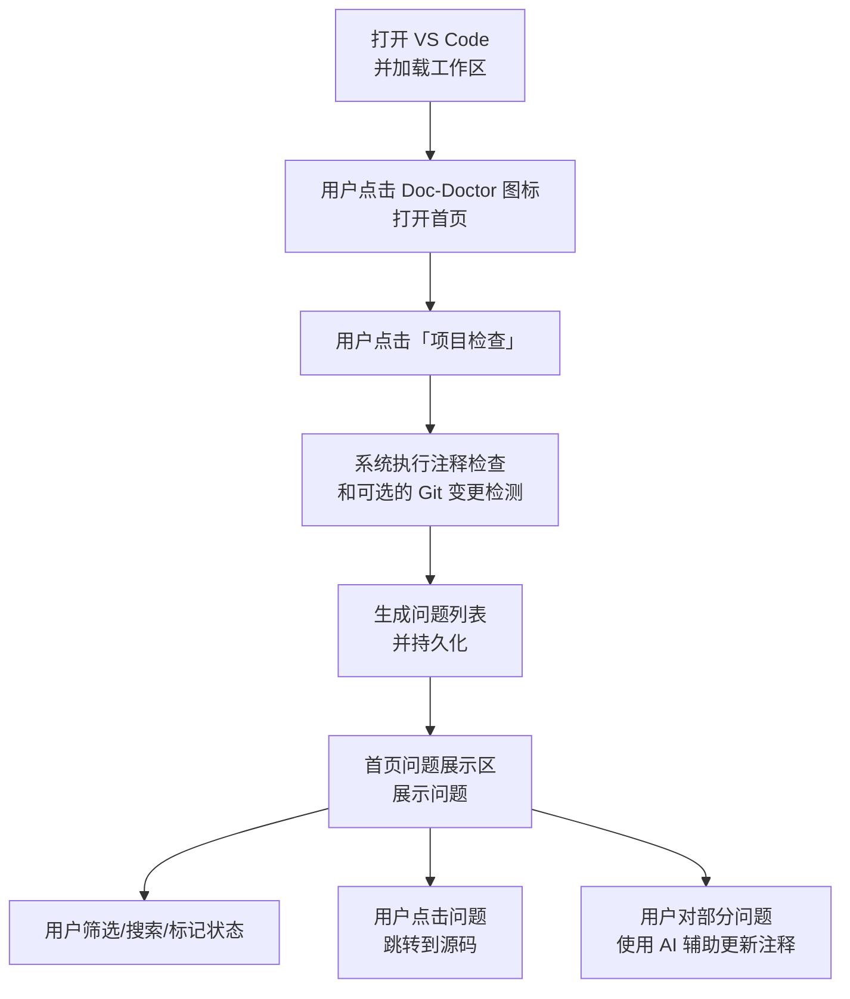
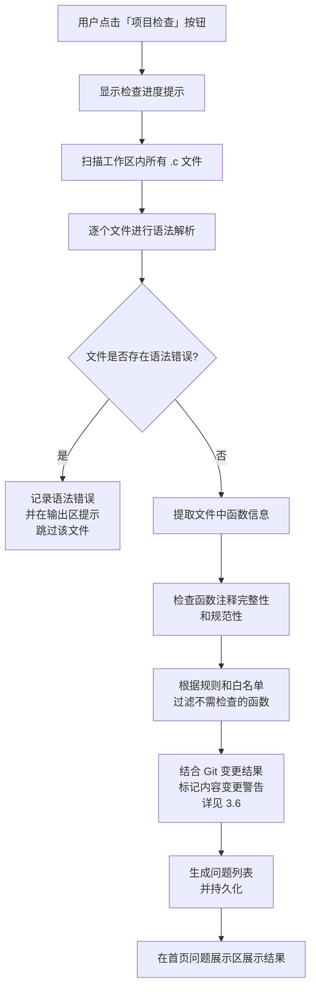
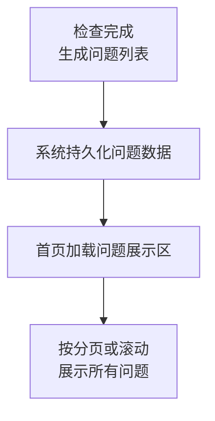
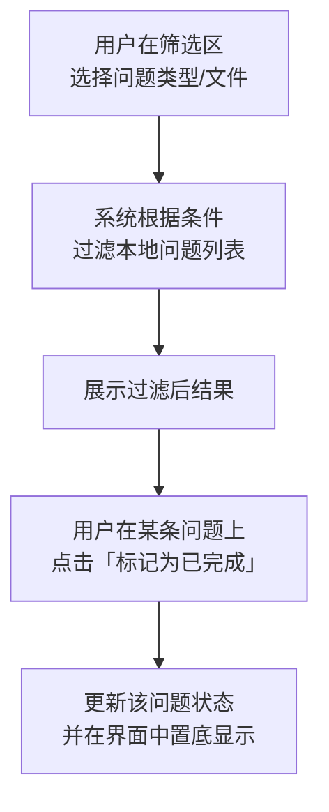
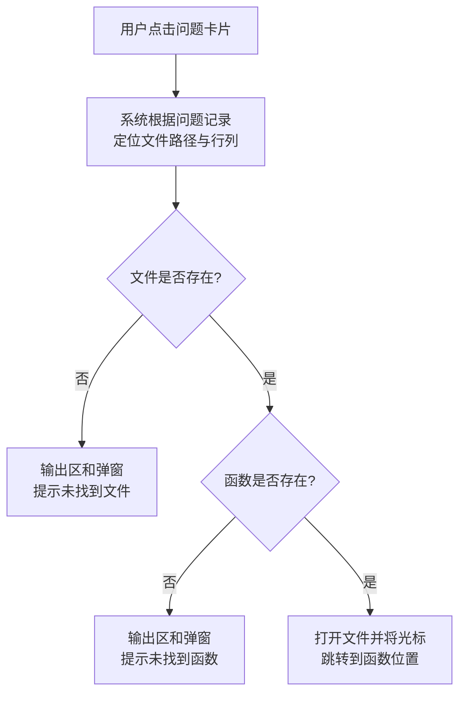
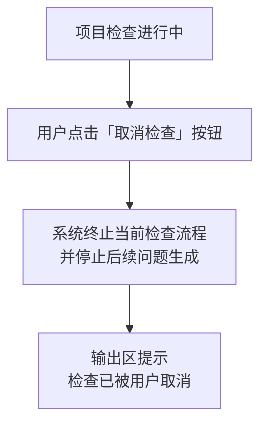
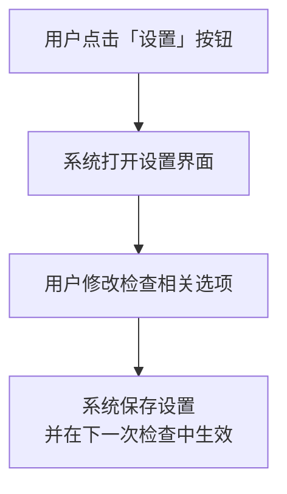
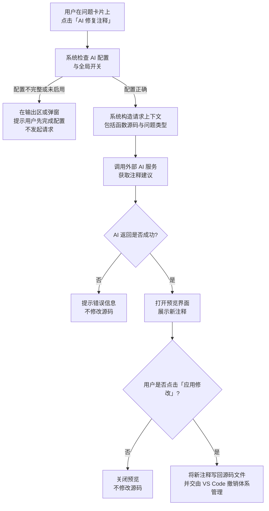

# Doc-Doctor 需求说明书（PRD）

---

## 第一章 引言

### 1.1 背景和目的

在 C/C 代码开发中，函数注释质量直接影响代码可读性、团队协作效率以及后续维护成本。大量工程项目中普遍存在以下问题：

- 函数缺少 `@brief/@param/@return` 等结构化注释；
- 函数实现已修改，但注释未同步更新；
- 历史遗留代码多、人工排查成本高；
- 跨团队协作时，对注释风格、质量难以统一。

Doc-Doctor 是一个运行于 VS Code 的注释检查插件，目标是**自动发现函数注释问题并辅助修复**，在不改变开发者工作流的前提下，持续提升工程内函数注释质量。

本需求文档旨在从“系统需要具备什么能力”的角度，完整描述 Doc-Doctor 的功能需求和主要非功能需求，为设计、开发与测试提供统一依据。

### 1.2 文档约定

1. 文档采用 Markdown 编写，内嵌少量 Mermaid 流程图说明关键业务流程。
2. 章节层级不超过三级：章（1.x）→ 节（x.y）→ 小节（x.y.z）。
3. 术语约定：
   - “系统”指 Doc-Doctor 插件整体；
   - “问题”指一次检查中发现的一条注释或语法相关异常记录；
   - “项目检查”指对当前工作区范围内符合条件文件的全量检查；
   - “问题展示区”指首页用于展示问题列表的区域；
   - “输出区”指 VS Code 输出面板中的日志信息区域。
4. 文中所有流程图使用 Mermaid `flowchart` 格式，仅用于说明业务流程，不代表具体技术实现方式。

### 1.3 预期读者和阅读建议

- 产品/需求人员：理解功能边界与使用场景，重点阅读第 2、3 章；
- 设计与开发人员：据此拆解模块与接口，重点阅读第 3、4 章；
- 测试人员：据此编写测试用例，重点阅读第 3 章功能说明与验收标准；
- 插件使用者/推广者：了解插件能力与限制，重点阅读第 2、3 章。

### 1.4 产品范围

Doc-Doctor 的产品范围包括：

- 面向 C 语言（`.c` 文件）的函数注释质量检查；
- 在 VS Code 内以侧边栏 Webview 的形式提供问题展示与交互操作；
- 支持基于 Git 的函数内容变更预警；
- 支持基于外部 AI 服务的注释生成与更新辅助；
- 提供灵活的检查规则与白名单配置能力；
- 提供问题结果的持久化与状态管理能力。

本版本不要求：

- 对所有语言的统一支持（仅以 `.c` 为主，可为后续扩展预留空间）；
- 对具体解析实现方式、存储引擎、线程模型做约束（这些属于设计与实现范畴）。

### 1.5 参考文献

- 《软件需求（第 2 版）》 Karl E. Wiegers 著
- 《需求分析与系统设计》 Leszek A. Maciaszek 著
- 《实用软件需求》 Benjamin L. Kovitz 著
- Doxygen 官方文档（注释风格约定参考）

---

## 第二章 系统概述

### 2.1 系统目标

系统设计目标如下：

1. **实用性**：为 C 项目提供可立即使用的注释质量检查能力，重点覆盖“注释缺失”和“内容变更未同步”两类高频问题。
2. **易用性**：以 VS Code 插件形式呈现，用户通过点击图标和按钮即可完成检查与查看结果，无需改造现有工程结构。
3. **可靠性**：在文件语法异常、Git 不可用、AI 服务异常等场景下，系统仍能稳定完成基础检查，并给出清晰提示。
4. **安全性**：在需要访问外部 AI 服务时，做到“用户有感、可配置、可关闭”，明确说明会发送的代码范围和数据内容。
5. **可扩展性**：在需求不变的前提下，后续可自然扩展到 `.h/.cpp` 等更多文件类型与注释风格模板。
6. **可维护性**：问题记录结构、设置项命名保持稳定，为后续版本升级与兼容提供基础。

### 2.2 用户特点

系统主要面向以下用户群体：

1. **日常开发者（主要用户）**：
   - 熟悉基本 C 语言开发；
   - 使用 VS Code 进行日常编码；
   - 希望快速发现并修复函数注释问题。
2. **代码维护者/审核者**：
   - 需要对历史工程进行注释质量盘点；
   - 在 Code Review 时，希望快速定位注释不一致或遗漏的函数。
3. **高级用户/项目维护者**：
   - 负责配置全局规则与白名单；
   - 决定是否启用 Git 变更预警和 AI 辅助注释；
   - 关注整体性能与使用策略。

### 2.3 可行性分析

- **技术可行性**：
  - VS Code 提供完善的扩展机制，可访问工作区文件并集成自定义 Webview；
  - 注释检查与函数提取可基于成熟的语法解析技术实现；
  - Git 环境广泛存在，可用于比较函数在不同提交间的变化；
  - 外部 AI 服务可通过标准 HTTP 接口调用，为注释生成提供支持。
- **用户可行性**：
  - 需求聚焦在“检查”和“建议”两个动作，对开发者学习成本低；
  - 功能以按钮和面板形式呈现，行为可预期，易于被开发者接受。
- **经济与演进可行性**：
  - 插件本身为开发工具，运行成本低；
  - AI 服务由用户自行配置或接入第三方，系统不强制依赖。

---

## 第三章 系统主要功能

### 3.1 功能总览

系统从用户视角提供以下核心能力：

1. 项目注释检查：对当前工作区 `.c` 文件进行全量扫描，发现函数注释问题与语法问题；
2. 问题展示与导航：在问题展示区中查看、筛选和搜索问题，并支持一键跳转到对应源码位置；
3. 检查控制：支持取消长时间运行的检查任务，并合理处理重复触发场景；
4. 规则与白名单配置：通过设置界面和 VS Code 配置项管理检查规则；
5. Git 函数内容变更警告：基于最近一次提交，对函数实现变更进行预警；
6. AI 辅助更新注释：对注释缺失或内容变更类问题提供 AI 生成/更新注释的能力；
7. 结果持久化与状态管理：保存最近一次检查结果，并支持问题状态更新（如标记为已完成）。

下图为用户在插件中的整体使用流程示意：



---

### 3.2 项目注释检查功能

#### 3.2.1 功能描述

当用户在首页点击“项目检查”按钮时，系统对当前工作区内符合条件的 `.c` 文件进行检查，发现并记录与函数注释和语法相关的问题，并在问题展示区中呈现。

检查范围与问题类型如下：

- 检查范围：
  - 仅检查扩展名为 `.c` 的文件；
  - 匿名函数不在检查范围内；
  - 超过设定大小上限（如 1MB）的文件跳过检查并给出提示；
  - 无读取权限的文件跳过检查并给出提示。
- 问题类型：
  - 参数说明缺失；
  - 返回值说明缺失；
  - 函数整体说明（`@brief`）缺失；
  - 函数内容变更警告（详见 3.6 章节）；
  - 语法错误（无法完成函数级别检查时以文件级错误给出提示）。

#### 3.2.2 功能流程（项目检查）



#### 3.2.3 注释规范与检查规则

系统规定统一的注释格式，以便正确解析和检查。采用 Doxygen 风格的注释：

- 每个函数应在定义前提供 Doxygen 注释块，至少包含：
  - `@brief`：函数功能的简要说明；
  - `@param`：对每个参数的说明；
  - `@return`：对返回值的说明（仅对非 `void` 函数）；
- 检查规则：
  - 若缺少 `@brief` 或等价功能描述，记录“函数体说明缺失”；
  - 若参数存在但缺少对应 `@param` 条目，记录“参数说明缺失”；
  - 若函数存在非 `void` 返回值但缺少 `@return` 描述，记录“返回值说明缺失”；
  - 当注释格式存在但内容为空或无实际含义时，视为对应类型缺失。

#### 3.2.4 边界条件与异常处理

- **语法错误文件**：
  - 对存在严重语法错误、无法正确解析函数的文件，不进行函数级检查；
  - 在输出区中提示“文件存在语法错误，未执行函数检查”；
  - 在问题展示区中以“语法错误”问题类型展示（按需）。
- **检查数量上限**：
  - 系统对单次检查返回的问题数量设置上限（如 1000 条），超过部分可不再记录，以避免界面卡顿；
  - 当达到上限时，在输出区给出提示。
- **检查耗时**：
  - 若检查时间超过预设阈值（如 30 秒），系统应提示用户当前检查耗时较长，并允许用户通过“取消检查”按钮终止本次检查。
- **重复触发**：
  - 当用户在前一轮检查尚未结束时再次点击“项目检查”，系统应以“后触发覆盖前触发”的方式处理：取消前一次检查，仅保留最新一次检查任务。

#### 3.2.5 功能验收

- 在项目中不存在符合条件的注释问题时：
  - 输出区提示“项目目前不存在相关问题噢”；
  - 问题展示区展示相应的空状态提示。
- 对包含语法错误的文件：
  - 系统在输出区明确指出文件路径及错误类型，并跳过该文件的函数级检查。
- 对注释缺失类问题：
  - 能够正确识别“参数说明缺失”“返回值说明缺失”“函数体说明缺失”，并在问题展示区与输出区给出准确描述。

---

### 3.3 问题展示与导航功能

#### 3.3.1 问题列表展示

系统在首页提供专门的“问题展示区”用于呈现本次检查的所有问题。每条问题记录至少包含：

- 问题类型（参数缺失 / 返回值缺失 / 函数体缺失 / 内容变更警告 / 语法错误）；
- 函数所在文件的相对路径；
- 函数名与签名（用于区分不同函数）；
- 函数代码片段（用于快速理解上下文）；
- 问题描述（对当前问题的简要说明）；
- 问题状态（正常 / 已完成）。



#### 3.3.2 筛选、搜索与状态管理

系统支持用户对问题列表进行多维度筛选与搜索：

- 按问题类型筛选：
  - 参数缺失 / 返回值缺失 / 函数体缺失；
  - 内容变更警告；
  - 语法错误；
- 按文件路径筛选：
  - 支持以目录或具体文件为条件；
- 搜索功能：
  - 支持按函数名或文件路径搜索问题；
- 状态管理：
  - 用户可将某条问题标记为“已完成”或取消标记；
  - 被标记为“已完成”的问题在问题列表中置底或以特殊样式区分显示；
  - 问题状态随检查结果一并持久化，用于下次打开插件时恢复展示。



#### 3.3.3 跳转代码位置

在问题展示区中，用户点击任一条问题时，系统应跳转至对应源码位置，方便用户快速查看与修改。

业务规则：

- 若对应文件和函数仍存在：
  - 打开对应文件；
  - 将光标移动到问题记录指定的行列位置（函数名起始处附近）。
- 若对应文件已被删除：
  - 在输出区提示“未找到文件”；
  - 在 VS Code 右下角弹出提示框给出相同提示。
- 若文件存在但对应函数已被删除：
  - 在输出区提示“未找到函数”；
  - 在 VS Code 右下角弹出提示框给出相同提示。



#### 3.3.4 功能验收

- 当项目无问题时，问题展示区应以明显的空状态展示，并与输出区提示信息一致；
- 对任一存在的问题：
  - 能根据筛选、搜索条件正确展示或隐藏；
  - 能正确跳转到对应的文件与行列位置；
- 对已删除文件/函数的问题：
  - 点击后不会导致异常行为，系统给出清晰提示。

---

### 3.4 检查控制与取消

#### 3.4.1 功能描述

系统在首页提供“取消检查”能力，用于终止当前正在执行的项目检查任务，提升用户在大项目场景下的可控性体验。



业务规则：

- 仅在检查进行中时展示或启用“取消检查”操作；
- 取消后不再继续扫描新文件，不再生成新问题；
- 已生成的问题仍可在展示区查看和操作。

#### 3.4.2 功能验收

- 检查进行中时，点击“取消检查”能够在合理时间内终止检查过程；
- 取消操作不会导致 VS Code 停顿或无响应；
- 取消后输出区提示清晰，用户可感知当前检查已结束。

---

### 3.5 规则与白名单配置

#### 3.5.1 功能描述

系统提供“设置”界面与 VS Code 配置项，用于控制检查行为及白名单规则。用户可通过点击首页上的“设置”按钮，进入配置界面。



#### 3.5.2 配置内容

典型配置包括但不限于：

- 是否检查 `main` 函数（如 `doc-doctor.checkMainFunction`，默认不检查）；
- 函数白名单列表（按文件路径组织，叶子节点为函数签名）；
- 文件白名单列表（指定目录或文件路径不参与检查）；
- 函数类型白名单（如按返回值类型对某些函数跳过检查）。

配置规则：

- 为避免同名函数干扰，函数的唯一标识由“文件路径 + 函数签名”共同确定；
- 当用户通过设置界面或 VS Code 配置修改规则后：
  - 新规则应在后续检查中生效；
  - 若后续版本提供“自动检查”能力（如在配置变更后自动触发一次检查），则应在设置中提供显式开关。

#### 3.5.3 配置文件与异常处理

系统读取 VS Code `settings.json` 中与 Doc-Doctor 相关的配置项：

```json
{
  "doc-doctor.checkMainFunction": false,
  "doc-doctor.functionWhitelist": {
    "src/file1.c": ["function1", "function2"],
    "src/file2.c": ["function3"]
  },
  "doc-doctor.fileWhitelist": [
    "src/legacy/",
    "test/"
  ],
  "doc-doctor.returnTypeWhitelist": ["void"]
}
```

异常场景处理：

- 若 `settings.json` 不存在或无法正常解析：
  - 系统采用内置默认配置；
  - 在输出区提示“配置文件不存在或异常，已使用默认设置”。
- 若配置内容发生变更：
  - 系统能够识别变更并重新加载配置；
  - 在输出区提示“识别到配置变更，已更新为新设置”，并可附带关键配置项的信息。

#### 3.5.4 功能验收

- 初始状态下，`main` 函数检查开关默认处于关闭状态；
- 当用户将某个存在注释问题的函数加入白名单并再次检查时：
  - 问题展示区不再展示该函数的相关问题；
- 当用户移除白名单并重新检查时：
  - 问题展示区能够重新展示该函数的问题记录。

---

### 3.6 基于 Git 的函数内容变更警告

本功能对应“第二版需求文档”中的“功能一：基于 Git 的函数内容变更警告”，在本章中进行梳理与整合。

#### 3.6.1 功能描述

当用户执行“项目检查”时，若启用了 Git 变更警告功能，系统会对当前分支**最近一次提交（`HEAD~1`）与当前工作区**之间的函数实现差异进行分析：

- 若某个函数的函数体内容发生了**实质性变更**，系统为该函数生成一条“内容变更警告”问题记录；
- 该问题类型用于提醒用户：“函数实现已经变化，请检查并同步更新 Doxygen 注释（`@brief/@param/@return` 等）”。

该能力仅在“项目全量检查”中生效，单文件检查不进行 Git 变更分析。

#### 3.6.2 功能流程（Git 变更检测）

```mermaid
flowchart TD
    A[开始执行项目检查] --> B[读取配置 doc-doctor.enableGitChangeWarning]
    B -->|未开启或为 false| C[跳过 Git 变更检测
仅执行常规注释检查]
    B -->|已开启| D[检测当前工作区是否为 Git 仓库
且存在至少两条提交]
    D -->|否| E[在输出区提示
"当前项目未使用 git，已跳过变更检测"]
    D -->|是| F[执行 git diff HEAD~1
获取 .c 文件变更列表]
    F --> G[对变更 .c 文件进行函数级对比
匹配当前与 HEAD~1 中的函数]
    G --> H{函数在 HEAD~1 中是否存在?}
    H -->|否，新函数| I[视为新增函数
不生成内容变更警告]
    H -->|是，既有函数| J[比较函数体内容
忽略空白和仅注释变更]
    J --> K{是否发生实质性变更?}
    K -->|否| L[不生成内容变更警告]
    K -->|是| M[生成 problem_type = 4
的内容变更警告问题]
    I --> N[与其它问题合并
进入统一问题列表]
    L --> N
    M --> N
    N --> O[统一写入问题存储
并在前端展示]
```

#### 3.6.3 实质性变更的定义

在比较当前版本与 `HEAD~1` 中同一文件路径 + 同一函数签名对应的函数体内容时：

- 忽略以下差异：
  - 仅有空格、缩进、换行等空白字符的变化；
  - 仅有函数体内部注释内容的变化（包括行注释和块注释），业务代码未发生变化。
- 在上述忽略规则之后，只要函数体文本不完全相同，即视为发生“实质性变更”。

即使用户已经手动更新了注释，只要函数体曾发生过实质性变更，本次检查仍会生成一条内容变更警告，用于提示近期发生的实现变化。

#### 3.6.4 新增/删除函数的处理

- **新增函数**：
  - 在 `HEAD~1` 中不存在、但当前版本中出现的新函数，视为“新增函数”；
  - 新增函数**不生成**内容变更警告问题；
  - 仍参与注释缺失等其它问题类型的检查。
- **删除函数**：
  - 在 `HEAD~1` 中存在、但当前版本已删除的函数，不生成任何问题记录；
  - 不为删除函数记录内容变更警告。

#### 3.6.5 配置项与前置条件

- 配置项：
  - `doc-doctor.enableGitChangeWarning: boolean`，控制是否启用 Git 变更警告，默认值为 `true`；
- 前置条件：
  - 当前工作区根目录能找到 `.git` 目录；
  - 当前分支存在至少两条提交，保证 `HEAD~1` 可用。
- 若任一前置条件不满足或无法调用 git：
  - 在输出区提示“当前项目未使用 git，已跳过变更检测”（或等价语义信息）；
  - 不执行任何 Git 相关逻辑，不生成 problem_type = 4 的问题；
  - 其它类型的注释检查与语法检查正常执行。

#### 3.6.6 问题记录与前端展示

当某个既有函数被判定为发生“实质性变更”时，系统应为其生成一条问题记录：

- `problem_type = 4`：表示“内容变更警告”；
- `file_path`：函数所在文件的相对路径；
- `function_name` 与 `function_signature`：用于唯一识别函数；
- `line_number` / `column_number`：指向当前版本函数定义所在行列，用于跳转定位；
- `problem_description`：统一文案，例如“函数体相对于上一次提交发生变更，请检查注释是否同步更新。”；
- `function_snippet`：保存当前版本的函数代码片段，用于前端展示；
- `check_timestamp` / `status`：与其它问题类型保持一致，状态初始为“正常”。

前端在问题展示中：

- 将内容变更警告视为一种普通问题类型；
- 在“按问题类型筛选”中提供对应选项；
- 支持与其它问题同样的搜索、标记和跳转行为。

#### 3.6.7 性能与历史不足策略

- 性能策略：
  - 使用 `git diff HEAD~1` 获取发生变化的文件列表，仅对其中扩展名为 `.c` 的文件执行函数级对比；
  - 对不在 diff 列表中的 `.c` 文件不做 Git 层面的函数体比较；
  - 若 diff 中仅包含非 `.c` 文件，则本次检查不会生成内容变更警告。
- 历史不足：
  - 当当前分支只有一条提交或无法解析 `HEAD~1` 时，视为“历史不足”，跳过本次变更检测；
  - 此时不生成内容变更警告，仅执行常规检查。

#### 3.6.8 功能验收

- 在启用 `doc-doctor.enableGitChangeWarning` 且当前仓库存在至少两条提交的前提下：
  - 对于仅修改空白或仅修改函数内部注释的函数，不应生成内容变更警告；
  - 对于业务代码发生变化的函数，应生成 problem_type = 4 的问题记录；
  - 新增函数不生成内容变更警告；
  - 删除函数不生成任何问题记录。
- 在非 Git 仓库、历史不足或 git 不可用场景下：
  - 输出区有明确跳过提示；
  - 其它检查功能不受影响。

---

### 3.7 AI 辅助更新函数注释

本功能对应“第二版需求文档”中的“功能二：AI 辅助更新函数注释”，在本章中进行整合。

#### 3.7.1 功能描述

在问题展示区中，对于“注释缺失”或“内容变更警告”类型的问题，系统可提供“AI 修复注释”入口。当用户主动点击后：

- 系统基于当前函数源码、已有注释、问题类型以及必要的变更信息，向用户配置的 AI 服务发送请求；
- AI 服务返回建议的 Doxygen 注释内容；
- 用户在预览界面中确认后，将注释写回源码文件。

该功能的目标是**降低手动书写和维护注释的成本，同时保持注释内容与函数实现的一致性**。

#### 3.7.2 适用问题类型

AI 修复能力适用于以下问题类型：

- 参数说明缺失（problem_type = 1）；
- 返回值说明缺失（problem_type = 2）；
- 函数体说明缺失（problem_type = 3）；
- 内容变更警告（problem_type = 4）。

对语法错误类问题（problem_type = 5）不提供 AI 修复入口。

#### 3.7.3 前端交互与流程



交互规则：

- 在单条问题的一次 AI 请求未完成前，禁止对同一问题重复发起请求；
- 请求失败时，结束加载状态并恢复按钮可点击；
- 写回源码后，系统不强制自动触发检查，由用户自行决定是否重新检查以刷新问题状态。

#### 3.7.4 配置与全局开关

系统通过 VS Code 配置项获取 AI 相关设置：

- `doc-doctor.enableAIRefactor: boolean`：是否启用 AI 修复功能；
- `doc-doctor.ai.endpoint: string`：AI 服务 HTTP 接口地址；
- `doc-doctor.ai.apiKey: string`：AI 服务访问密钥；
- 其他可选参数（如模型名称、超时时间）可在后续版本扩展。

行为约定：

- 当 `doc-doctor.enableAIRefactor = false` 时：
  - 问题列表中不展示任何与 AI 相关的按钮；
  - 不发起任何 AI 相关网络请求。
- 当 `doc-doctor.enableAIRefactor = true` 且 `endpoint/apiKey` 配置不完整时：
  - 用户点击“AI 修复注释”后，系统直接给出“AI 服务未正确配置”的提示，不发起请求。

#### 3.7.5 请求上下文与生成规则

请求上下文应包含：

- 当前函数的完整源码（含函数头和函数体）；
- 当前已有的注释内容（若有）；
- 问题类型（1/2/3/4）；
- 文件路径、函数名、函数签名等元信息；
- 对于内容变更警告问题，可附带最近一次变更的简要信息（如相关 diff 片段）。

生成规则：

- 语言选择：
  - 若当前函数已有注释且主要为英文，优先生成英文注释；
  - 否则默认生成简体中文注释。
- 注释风格：
  - 统一采用 Doxygen 风格注释块，包含 `@brief/@param/@return` 等常用标签；
  - 内容以简洁、职责明确为主，避免过度冗长。
- 不同问题类型：
  - 对注释缺失类问题（1/2/3）：生成完整或补全后的 Doxygen 注释块；
  - 对内容变更警告问题（4）：在原注释基础上进行“最小必要改动”，使其与当前实现相一致。

系统在写回前可做轻量校验：

- 若缺少关键标签（如非 `void` 函数缺少 `@return`），可自动补一个占位说明，以免立刻触发新的注释缺失问题；
- 更复杂的语义正确性仍交由后续常规检查来验证。

#### 3.7.6 隐私与异常处理

- 隐私提示：
  - 在 README 与设置界面中，需要明确告知用户：启用 AI 修复功能时，插件会将当前函数源码与注释内容发送至用户配置的 AI 服务，仅用于生成或更新注释。
- 异常场景：
  - 网络超时、连接错误、鉴权失败、返回格式异常等情况，均需在前端以可理解的方式进行提示；
  - 任何异常情况下均不得在未经用户确认的前提下修改源码文件。

#### 3.7.7 功能验收

- 在正确配置 `doc-doctor.ai.endpoint`、`doc-doctor.ai.apiKey` 且启用 `doc-doctor.enableAIRefactor` 的前提下：
  - 对于 problem_type 为 1/2/3/4 的问题，应展示“AI 修复注释”按钮；
  - 点击后能正确进入加载状态，随后出现预览界面；
  - 生成的注释满足 Doxygen 基本结构要求，并与函数大致语义匹配；
  - 用户点击“应用修改”后，相应函数上方注释被正确插入或替换。
- 对 problem_type = 5（语法错误）的问题不展示 AI 修复入口；
- 在未启用 `doc-doctor.enableAIRefactor` 或配置不完整时：
  - 不发起任何对外 AI 请求；
  - 给出清晰错误/引导提示。

---

## 第四章 其它非功能需求

### 4.1 性能需求

#### 4.1.1 系统可用性

- 系统应在日常规模的 C 项目上保持流畅可用；
- 对用户而言，主要操作为点击按钮和查看结果，界面操作需清晰直观；
- 在出现配置异常、Git 不可用或 AI 服务失败时，仍能保证基础注释检查功能可正常使用。

#### 4.1.2 时间特性

系统性能应满足以下量化指标：

**单文件检查性能**：
- P95 延迟 ≤ 500ms（文件大小 < 100KB，函数数量 < 50）
- P99 延迟 ≤ 1000ms（文件大小 < 100KB）
- 最大超时时间：5秒（单文件）

**项目全量检查性能**：
- 100 个文件规模：P95 延迟 ≤ 30秒
- 500 个文件规模：P95 延迟 ≤ 120秒
- 1000 个文件规模（上限）：P95 延迟 ≤ 300秒
- 检查超过 60 秒时，应显示进度提示
- 支持用户随时取消检查操作

**数据库操作性能**：
- 单次插入操作：P95 延迟 ≤ 50ms
- 单次查询操作：P95 延迟 ≤ 50ms
- 批量插入（100条）：P95 延迟 ≤ 2秒

**AI 请求性能**：
- 网络请求超时：30秒（可配置）
- 响应解析时间：≤ 500ms

**其他操作**：
- 配置加载：≤ 100ms
- 问题跳转定位：≤ 200ms

**性能测试场景**：
- 支持 10,000 个 `.c` 文件规模的扫描测试（内存占用 < 500MB）
- 单个函数代码片段最大支持 5,000 字符
- 单个问题描述最大支持 10,000 字符

当检查时间超过上述指标时：
  - 应通过进度提示告知当前状态和预计剩余时间；
  - 提供“取消检查”能力，以避免用户长时间无反馈等待。

#### 4.1.3 扩展性

- 系统在需求不变的前提下，应支持后续：
  - 将检查范围从 `.c` 扩展到 `.h/.cpp` 等文件类型；
  - 支持多种注释风格模板（如 Doxygen/Javadoc 等）的切换；
  - 支持 Git diff 模式仅对变更范围执行检查；
  - 集成到提交钩子（pre-commit/pre-push）等工作流中。

#### 4.1.4 边界条件与压测需求

**文件数量边界**：
- 支持最大 10,000 个 `.c` 文件的扫描
- 单次检查最多返回 1,000 条问题记录（超出部分不再记录，并在输出区提示）
- 单个文件最大大小限制：1MB（超过自动跳过）

**内存使用限制**：
- 大项目扫描时内存占用应 < 500MB
- 单次加载到内存的问题列表最大不超过 100MB

**并发场景**：
- 支持多个 VS Code 窗口同时打开同一工作区（数据库操作需处理 `SQLITE_BUSY` 错误）
- 支持检查过程中用户频繁切换文件或修改配置

**压测场景**：
- 10,000 个文件（平均每个文件 10KB，总计约 100MB）：扫描时间 ≤ 10分钟，内存占用 < 500MB
- 1,000 个函数（单个文件）：解析时间 ≤ 2秒
- 1,000 条问题记录：数据库批量插入时间 ≤ 5秒

### 4.2 可用性与界面友好性

- 用户主要通过 VS Code 侧边栏图标打开插件首页；
- 首页提供统一入口：项目检查、问题展示、设置入口等；
- 设置界面应对各项配置给出简要说明和默认值提示；
- 错误信息、提示信息统一通过输出区及必要的弹窗呈现，措辞清晰可理解。

### 4.3 安全性与隐私

#### 4.3.1 本地检查安全性

- 对于纯本地检查场景，系统不主动上传项目代码至任何外部服务；
- 数据库文件仅存储在本地工作区 `.doc-doctor/problems.db`，不会上传到任何服务器；
- 所有检查逻辑均在本地执行，无需网络连接。

#### 4.3.2 AI 功能隐私保护

**默认状态**：
- AI 辅助功能默认**关闭**状态（`doc-doctor.enableAIRefactor` 默认值为 `false`）
- 用户必须手动在设置中启用该功能


**数据发送范围**：
- 仅在用户显式点击"AI 修复注释"按钮时，才会向配置的 AI 服务发送**当前选中函数**的源码与注释内容；
- 不会批量上传整个项目或文件内容；
- 每次请求仅发送单个函数的上下文信息。

**API Key 存储安全**：
- API Key 等敏感信息应使用 VS Code 的 `SecretStorage` API 加密存储；
- 当前版本 API Key 存储在 `settings.json` 中，用户需自行注意配置文件安全，避免将包含 API Key 的配置文件提交到版本控制系统。

**数据记录**：
- 不记录除必要调试日志外的额外敏感信息；
- 不在本地持久化存储 AI 请求的代码内容或响应结果；
- 调试日志中仅记录请求状态（成功/失败），不记录完整的代码内容。

#### 4.3.3 配置文件安全建议

- 建议用户在 `.gitignore` 中添加 `.vscode/settings.json`，避免 API Key 泄露（如果项目需要共享配置，可使用 `settings.json.template` 作为模板）
- 建议使用工作区级别配置而非用户级别配置，避免跨项目泄露 API Key

### 4.4 可靠性与可维护性

- 在配置异常、Git 不可用、AI 服务失败等场景下，基础注释检查功能应保持可用；
- 问题记录结构与配置项命名在版本演进中保持兼容，必要时提供迁移策略说明；
- 日志信息应涵盖关键行为（如检查启动/结束、配置变更、Git/AI 相关异常），便于问题排查。

