```mermaid
flowchart LR
    A[读å–文件] --> B[正则匹é…函数] --> C[æå–注释] --> D[æ„建 FunctionInfo]
```

# Doc-Doctor 设计文档

## 文档信息

| 项目名称 | Doc-Doctor |
|---------|-----------|
| 版本    | v0.0.1     |
| 创建日期 | 2025-12-24 |
| 文档类型 | 技术设计文档 (TD) |

---

## 1. 项目概述

### 1.1 项目背景

Doc-Doctor 是一款 Visual Studio Code 扩展插件，旨在帮助开发者自动检测 C/C++ 项目中函数注释的完整性问题。通过静态代码分析，该工具能够识别缺失的参数说明、返回值说明、函数功能描述等常见文档问题，提升代码可维护性和团队协作效率。

### 1.2 项目目标

- 自动扫描项目中的 C/C++ 源文件，解析函数定义
- 检测函数注释是否符合 Doxygen 规范
- 提供直观的问题展示界面和一键跳转功能
- 支持灵活的白名单配置（文件、函数、返回值类型）
- 持久化存储检查结果，支持跨会话查看

### 1.3 技术栈

| 层级 | 技术选型 | 说明 |
|------|---------|------|
| 前端 | VS Code Webview + HTML/CSS/JS | 使用 VS Code Webview UI Toolkit 构建侧边栏界面 |
| 服务层 | TypeScript | 扩展核心逻辑，文件解析、函数检查、白名单过滤 |
| 数据交互层 | TypeScript + C++ (DLL) | TypeScript 通过 koffi 调用 C++ 动态库 |
| 数据存储 | SQLite3 | 轻量级嵌入式数据库，存储检查结果 |
| 构建工具 | npm + CMake | TypeScript 编译 + C++ 动态库构建 |

---

## 2. 系统架构设计

### 2.1 整体架构图

```mermaid
graph TB
    UI[前端 Webview] -->|postMessage| EXT[扩展主体 Extension]
    EXT --> SERVICE[服务层模块]
    SERVICE --> DB_TS[数据库桥接 TS]
    DB_TS -->|koffi FFI| DB_CPP[C++ DLL]
    DB_CPP --> SQLITE[(SQLite3)]
```



**架构说明**：

系统采用前后端分离的分层架构设计：

1. **前端层（Webview）**：基于 HTML/CSS/JS 实现的侧边栏界面，使用 VS Code Webview UI Toolkit 组件库。负责用户交互、问题列表展示、设置配置等界面功能。

2. **扩展主体（Extension Host）**：TypeScript 编写的 VS Code 扩展核心，运行在独立的 Node.js 进程中。负责接收前端消息、调度业务模块、管理扩展生命周期。

3. **服务层模块**：包含文件解析、函数检查、白名单过滤、跳转定位等业务逻辑模块，各模块职责单一、相互协作。

4. **数据交互层**：TypeScript 桥接层通过 koffi 库（FFI 外部函数接口）调用 C++ 编译的动态链接库（DLL），实现跨语言调用。

5. **数据存储层**：使用 SQLite3 嵌入式数据库持久化存储检查结果，数据库文件位于工作区 `.doc-doctor/problems.db`。

6. **配置文件**：白名单等用户配置存储在工作区的 `.vscode/settings.json` 中，扩展启动时自动读取并监听变更。

### 2.2 分层架构说明

系统采用 **三层架构** 设计：

| 层级 | 职责 | 主要模块 |
|------|------|---------|
| **表现层** | 用户界面交互，结果展示 | Webview (sidebar.js) |
| **服务层** | 业务逻辑处理，文件解析，检查规则 | extension.ts, projectCheck.ts, fileCheck.ts, functionCheck.ts, fileWhiteList.ts, jumpToLocation.ts |
| **数据层** | 数据持久化，SQLite 操作 | database.ts (TS桥接), database.cpp (C++实现) |

### 2.3 通信机制

```mermaid
sequenceDiagram
    participant W as Webview
    participant E as Extension
    participant D as Database (C++)
    
    Note over W,E: VS Code Webview 消æ¯é€šä¿¡
    W->>E: postMessage({type: 'runProjectCheck'})
    E->>E: 扫æ工作区文件
    E->>E: 解æ函数定义
    E->>E: 检查注释完整性
    E->>D: saveProblemToDB()
    D-->>E: insertedId
    E-->>W: postMessage({type: 'projectCheckResult', result})
```



**通信机制说明**：

由于 VS Code 的安全模型限制，Webview 运行在隔离的 iframe 中，无法直接访问 Node.js API 或扩展代码。因此，前后端通信必须通过 postMessage 机制实现：

1. **前端发送消息**：Webview 调用 `vscode.postMessage({type: 'xxx', data: {...}})` 发送请求，消息类型包括 `runProjectCheck`（启动检查）、`jumpToProblem`（跳转定位）、`saveSettings`（保存设置）等。

2. **后端接收处理**：Extension 通过 `webview.onDidReceiveMessage` 监听消息，根据 `type` 字段分发到对应的处理函数。

3. **后端回传结果**：处理完成后，Extension 调用 `webview.postMessage({type: 'xxxResult', result: {...}})` 将结果回传给前端。

4. **前端渲染更新**：Webview 通过 `window.addEventListener('message', ...)` 接收响应，更新界面状态。

这种异步消息通信模式确保了扩展的安全性和稳定性，同时支持复杂的交互场景。

---

## 3. 模块设计

### 3.1 模块依赖关系


**模块职责与依赖说明**：

1. **extension.ts（扩展入口）**：作为整个扩展的调度中心，负责初始化各模块、注册命令和视图、分发用户请求。它直接依赖 `projectCheck.ts` 和 `jumpToLocation.ts` 两个主要功能模块。

2. **projectCheck.ts（总检查模块）**：核心业务协调者，接收检查请求后依次调用：
   - `fileCheck.ts`：解析源文件，提取函数信息
   - `functionCheck.ts`：检查每个函数的注释完整性
   - `fileWhiteList.ts`：应用白名单过滤规则
   - `database.ts`：将检查结果持久化存储

3. **jumpToLocation.ts（跳转模块）**：独立功能模块，负责根据问题记录的位置信息打开文件并定位光标。

4. **database.ts（数据库桥接层）**：封装与 C++ DLL 的交互逻辑，提供 TypeScript 友好的异步接口，内部通过 koffi 库调用原生代码。

这种模块化设计遵循单一职责原则，便于独立测试和维护。

### 3.2 核心模块说明

#### 3.2.1 扩展入口模块 (extension.ts)

**职责**：

- 注册 VS Code 扩展生命周期
- 初始化侧边栏 Webview Provider
- 处理 Webview 与扩展的消息通信
- 监听配置文件变更

**关键类**：
```typescript
class DocDoctorSidebarProvider implements vscode.WebviewViewProvider {
  resolveWebviewView(webviewView, context, token)  // 初始化 Webview
  onConfigurationChanged()                          // 配置变更处理
  postCurrentSettings(webview)                      // 发送设置到前端
}
```

#### 3.2.2 文件解析模块 (fileCheck.ts)

**职责**：
- 读取 C/C++ 源文件内容
- 使用正则表达式提取函数定义
- 提取函数前的 Doxygen 注释块
- 计算函数位置（行号、列号）

**核心数据结构**：
```typescript
interface FunctionInfo {
  filePath: string;           // 文件路径
  functionName: string;       // 函数名
  functionSignature: string;  // 函数签名
  comment: string;            // 注释内容
  functionContent: string;    // 函数体
  lineNumber: number;         // 行号
  columnNumber: number;       // 列号
}
```

**解析流程**：


**解析流程说明**：

1. **读取文件**：通过 VS Code 的 `workspace.fs.readFile` API 读取源文件的 UTF-8 文本内容。

2. **正则匹配函数**：使用正则表达式 `/([\w\s\*]+?)\s+([A-Za-z_][A-Za-z0-9_]*)\s*\([^)]*\)\s*\{/g` 匹配 C/C++ 函数定义。同时过滤掉 `if`、`for`、`while`、`switch` 等控制语句的误匹配。

3. **提取注释**：从函数定义位置向上搜索最近的 `/** ... */` 或 `/* ... */` 注释块，检查注释块与函数之间是否只有空白字符，确保注释确实属于该函数。

4. **构建 FunctionInfo**：计算函数名在源码中的行号和列号（用于后续跳转定位），组装完整的函数信息对象供后续检查使用。

#### 3.2.3 函数检查模块 (functionCheck.ts)

**职责**：

- 检查函数注释是否符合 Doxygen 规范
- 识别缺失的 @brief、@param、@return 标签
- 生成问题描述信息

**问题类型枚举**：
```typescript
enum ProblemType {
  PARAM_MISSING = 1,    // 参数说明缺失
  RETURN_MISSING = 2,   // 返回值说明缺失
  BRIEF_MISSING = 3,    // 函数体说明缺失
  CONTENT_CHANGED = 4,  // 内容变更警告
  SYNTAX_ERROR = 5,     // 语法错误
}
```

**检查规则**：
| 规则 | 检查条件 | 问题类型 |
|------|---------|---------|
| @brief 检查 | 注释中无 @brief 且无功能描述 | BRIEF_MISSING |
| @param 检查 | 函数参数无对应 @param 说明 | PARAM_MISSING |
| @return 检查 | 非 void 函数无 @return 说明 | RETURN_MISSING |

#### 3.2.4 总检查模块 (projectCheck.ts)

**职责**：

- 扫描工作区所有 C/C++ 文件
- 协调文件解析和函数检查
- 应用白名单过滤规则
- 聚合检查结果并存入数据库

**检查流程**：


**检查流程说明**：

1. **读取配置**：从 VS Code 配置中获取白名单规则，包括是否检查 main 函数、文件白名单、函数白名单、返回类型白名单。

2. **查找文件**：使用 `workspace.findFiles('**/*.{c,cpp}')` 查找工作区内所有 C/C++ 源文件，最多返回 1000 个文件。

3. **遍历文件**：对每个文件依次进行以下处理：
   - **白名单过滤**：检查文件路径是否匹配文件白名单前缀，匹配则跳过
   - **大小检查**：文件超过 1MB 则跳过，避免处理过大文件
   - **语法错误检查**：通过 VS Code 诊断 API 获取文件的编译错误，若存在则记录语法错误问题并跳过注释检查

4. **解析函数**：对通过预检查的文件调用 `fileCheck.ts` 解析所有函数定义。

5. **检查注释**：对每个函数应用函数级白名单过滤后，调用 `functionCheck.ts` 检查注释完整性。

6. **记录问题**：将发现的问题收集到列表中，达到 1000 条上限时停止检查。

7. **保存到数据库**：检查完成后，清空旧数据并将新问题批量写入 SQLite 数据库。

#### 3.2.5 白名单模块 (fileWhiteList.ts)

**职责**：
- 读取 VS Code 配置中的白名单规则
- 提供文件、函数、返回类型的过滤判断

**配置结构**：
```json
{
  "doc-doctor.checkMainFunction": false,
  "doc-doctor.fileWhitelist": ["test/", "vendor/"],
  "doc-doctor.functionWhitelist": {
    "src/file.c": ["init", "cleanup"],
    "*": ["globalHelper"]
  },
  "doc-doctor.returnTypeWhitelist": ["void"]
}
```

**过滤优先级**：
1. main 函数检查开关
2. 文件白名单（前缀匹配）
3. 函数白名单（文件级 + 全局级）
4. 返回值类型白名单

#### 3.2.6 跳转模块 (jumpToLocation.ts)

**职责**：
- 根据文件路径、行号、列号定位代码位置
- 打开目标文件并移动光标
- 支持函数名模糊匹配定位

**跳转流程**：



**跳转流程说明**：

1. **接收请求**：从前端接收跳转请求，包含文件路径（filePath）、行号（lineNumber）、列号（columnNumber）和可选的函数名（functionName）。

2. **解析路径**：判断路径是否为绝对路径，若是相对路径则与工作区根目录拼接生成完整路径。

3. **文件存在性检查**：调用 `workspace.fs.stat` API 验证目标文件是否存在，若不存在则通过 `showErrorMessage` 弹出错误提示并终止流程。

4. **打开文档**：调用 `workspace.openTextDocument` 打开目标文件，再通过 `window.showTextDocument` 在编辑器中显示。

5. **定位光标**：若提供了函数名，则在目标行附近（±5行范围）搜索包含该函数名的行，提高定位准确性。最后设置光标位置并调用 `revealRange` 将目标行滚动到编辑器中央。

#### 3.2.7 数据库模块 (database.ts + database.cpp)

**职责**：
- TypeScript 层：提供异步接口，处理 JSON 序列化
- C++ 层：实际的 SQLite 操作

**接口设计**：
```typescript
// TypeScript 桥接层
function initDB(extensionUri: vscode.Uri): boolean
function saveProblemToDB(problem: ProblemInfo): Promise<SaveResult>
function loadProblemsFromDB(): Promise<LoadResult>
function updateProblemStatusInDB(id: number, status: ProblemStatus): Promise<boolean>
function clearAllProblems(): Promise<boolean>
```

```cpp
// C++ 导出接口
extern "C" {
  int initDatabase(const char* dbPath);
  int saveProblem(const char* jsonInput);
  const char* loadAllProblems();
  int updateProblemStatus(int id, int status);
  int clearProblems();
  void closeDatabase();
}
```

---

## 4. 数据流程设计

### 4.1 项目检查流程



**流程详细说明**：

1. **用户触发**：用户在侧边栏界面点击"检查整个项目"按钮，前端 Webview 发送 `runProjectCheck` 类型的消息。

2. **扩展处理**：Extension 接收到消息后，调用 `runProjectCheck` 函数启动检查流程。检查过程中通过 VS Code 的进度通知 API 显示当前正在检查的文件名。

3. **业务处理**：
   - 使用 `workspace.findFiles` 查找所有 `.c` 和 `.cpp` 文件
   - 对每个文件进行白名单过滤、大小检查、语法错误检测
   - 调用 `fileCheck` 解析函数定义，调用 `functionCheck` 检查注释完整性
   - 收集所有发现的问题到数组中

4. **数据持久化**：调用 `saveProblemsToDBBatch` 先清空旧数据，再批量插入新问题。

5. **结果返回**：将 `CheckAllResult` 对象（包含总文件数、已检查数、跳过文件列表、问题列表）通过 `postMessage` 回传给前端。

6. **界面更新**：前端接收到 `projectCheckResult` 消息后，渲染问题卡片列表，支持按类型筛选和关键词搜索。

### 4.2 问题跳转流程



**流程详细说明**：

1. **用户触发**：用户在问题展示区点击某个问题卡片，前端从问题对象中提取 `filePath`、`lineNumber`、`columnNumber` 和 `functionName` 字段，发送 `jumpToProblem` 消息。

2. **扩展处理**：Extension 验证参数完整性后，调用 `jumpToLocation` 函数。

3. **文件定位**：
   - 将相对路径转换为绝对路径
   - 验证文件是否存在（若文件被删除则弹出错误提示）
   - 打开文档并在编辑器中显示

4. **光标定位**：
   - 若提供了函数名，在目标行附近搜索精确位置
   - 将光标移动到目标行的首个非空白字符位置
   - 调用 `revealRange` 将目标行滚动到编辑器视口中央

5. **视觉反馈**：编辑器自动聚焦到目标文件和位置，用户可以立即开始修改代码。

### 4.3 设置保存流程



**流程详细说明**：

1. **用户编辑**：用户在设置页面修改配置项，包括：
   - 是否检查 main 函数（复选框）
   - 文件白名单（多行文本框，每行一个路径前缀）
   - 函数白名单（多行文本框，支持 `文件路径:函数名` 格式）
   - 返回类型白名单（多行文本框，每行一个类型如 `void`）

2. **前端收集**：点击"保存设置"按钮后，前端将表单数据序列化为对象，发送 `saveSettings` 消息。

3. **配置写入**：Extension 解析接收到的数据，调用 `workspace.getConfiguration('doc-doctor')` 获取配置对象，依次调用 `config.update()` 方法将各项配置写入工作区的 `.vscode/settings.json` 文件。

4. **反馈通知**：写入成功后通过 `showInformationMessage` 显示"设置已保存"提示，并向前端发送 `settingsSaved` 消息更新界面状态。

5. **自动重检**：保存完成后自动调用 `runProjectCheck` 重新执行项目检查，确保新配置立即生效。用户无需手动点击检查按钮。

6. **配置监听**：Extension 还注册了 `onDidChangeConfiguration` 监听器，若用户直接编辑 `settings.json` 文件，也能自动感知并同步到前端界面。

---

## 5. 数据结构设计

### 5.1 数据库表结构

**problems 表**：

```sql
CREATE TABLE IF NOT EXISTS problems (
    id INTEGER PRIMARY KEY AUTOINCREMENT,
    problem_type INTEGER NOT NULL,
    file_path TEXT NOT NULL,
    function_signature TEXT,
    function_name TEXT NOT NULL,
    line_number INTEGER DEFAULT 1,
    column_number INTEGER DEFAULT 1,
    problem_description TEXT,
    function_snippet TEXT,
    check_timestamp TEXT NOT NULL,
    status INTEGER DEFAULT 0
);
```

**字段说明**：

| 字段名 | 类型 | 约束 | 说明 |
|--------|------|------|------|
| id | INTEGER | PRIMARY KEY AUTOINCREMENT | 问题唯一标识 |
| problem_type | INTEGER | NOT NULL | 问题类型 (1-5) |
| file_path | TEXT | NOT NULL | 文件相对路径 |
| function_signature | TEXT | | 函数签名 |
| function_name | TEXT | NOT NULL | 函数名 |
| line_number | INTEGER | DEFAULT 1 | 函数所在行号 |
| column_number | INTEGER | DEFAULT 1 | 函数名所在列号 |
| problem_description | TEXT | | 问题描述 |
| function_snippet | TEXT | | 函数代码片段 |
| check_timestamp | TEXT | NOT NULL | 检查时间 (ISO 8601) |
| status | INTEGER | DEFAULT 0 | 状态: 0=正常, 1=已完成 |

### 5.2 核心类型定义

```typescript
// 函数信息
interface FunctionInfo {
  filePath: string;
  functionName: string;
  functionSignature: string;
  comment: string;
  functionContent: string;
  lineNumber: number;
  columnNumber: number;
}

// 问题信息
interface ProblemInfo {
  problemType: ProblemType;
  filePath: string;
  functionName: string;
  functionSignature: string;
  lineNumber: number;
  columnNumber: number;
  problemDescription: string;
  functionSnippet: string;
}

// 数据库记录（扩展 ProblemInfo）
interface ProblemRecord extends ProblemInfo {
  id: number;
  checkTimestamp: string;
  status: ProblemStatus;
}

// 检查结果
interface CheckAllResult {
  success: boolean;
  totalFiles: number;
  checkedFiles: number;
  skippedFiles: string[];
  problems: ProblemInfo[];
  errorMessage?: string;
}

// 白名单配置
interface DocDoctorSettings {
  checkMainFunction: boolean;
  functionWhitelist: Record<string, string[]>;
  fileWhitelist: string[];
  returnTypeWhitelist: string[];
}
```

---

## 6. 前端界面设计

### 6.1 界面结构

侧边栏采用 **Tab 面板** 布局，包含三个标签页：

```
┌─────────────────────────────────────┐
│  [检查]  [设置]  [调试]               │
├─────────────────────────────────────┤
│                                     │
│  (当前选中标签页的内容)                │
│                                     │
├─────────────────────────────────────┤
│  输出日志                            │
│  ─────────────────────              │
│  (日志内容区域)                       │
│                                     │
└─────────────────────────────────────┘
```

### 6.2 检查页设计

```
┌─────────────────────────────────────┐
│  核心检查                            │
│  ┌─────────────┐ ┌─────────────────┐│
│  │检查单个文件   │ │ 检查整个项目      ││
│  └─────────────┘ └─────────────────┘│
├─────────────────────────────────────┤
│  问题展示区                          │
│  ┌──────────────────┐ ┌───────────┐│
│  │ 🔍 搜索文件/函数...│ │ 所有类型 ▼ ││
│  └──────────────────┘ └───────────┘│
│                                     │
│  ┌─────────────────────────────────┐│
│  │ ○ add  @ 行 25          参数缺失 ││
│  │ src/math.c : 5                  ││
│  │ 缺少参数 "a" 的说明               ││
│  └─────────────────────────────────┘│
│  ┌─────────────────────────────────┐│
│  │ ○ calculate  @ 行 42   返回值缺失││
│  │ src/utils.c : 8                  ││
│  │ 缺少 @return 说明                ││
│  └─────────────────────────────────┘│
│                                     │
└─────────────────────────────────────┘
```

### 6.3 问题卡片交互

- **点击卡片**：跳转到对应函数位置
- **点击标记按钮 (○/✓)**：切换完成状态
- **已完成问题**：置底显示，透明度降低

### 6.4 设置页设计

```
┌─────────────────────────────────────┐
│  检查规则                            │
│  ☐ 检查 main 函数                    │
├─────────────────────────────────────┤
│  文件白名单                          │
│  (每行一个路径，支持目录)             │
│  ┌─────────────────────────────────┐│
│  │ test/                            ││
│  │ vendor/                          ││
│  │ src/legacy/                      ││
│  └─────────────────────────────────┘│
├─────────────────────────────────────┤
│  函数白名单                          │
│  (每行一个函数名)                     │
│  ┌─────────────────────────────────┐│
│  │ init                             ││
│  │ cleanup                          ││
│  └─────────────────────────────────┘│
├─────────────────────────────────────┤
│  返回值类型白名单                     │
│  ┌─────────────────────────────────┐│
│  │ void                             ││
│  └─────────────────────────────────┘│
│                                     │
│  ┌─────────────────────────────────┐│
│  │         保存设置                  ││
│  └─────────────────────────────────┘│
└─────────────────────────────────────┘
```

### 6.5 Webview 消息类型

| 消息类型 | 方向 | 说明 |
|---------|------|------|
| `runSingleFileCheck` | Webview → Extension | 触发单文件检查 |
| `runProjectCheck` | Webview → Extension | 触发项目检查 |
| `jumpToProblem` | Webview → Extension | 跳转到问题位置 |
| `saveSettings` | Webview → Extension | 保存设置 |
| `updateProblemStatus` | Webview → Extension | 更新问题状态 |
| `cancelCheck` | Webview → Extension | 取消检查 |
| `requestSettings` | Webview → Extension | 请求当前设置 |
| `projectCheckResult` | Extension → Webview | 检查结果 |
| `databaseLoadResult` | Extension → Webview | 数据库读取结果 |
| `initSettings` | Extension → Webview | 初始化设置数据 |
| `settingsSaved` | Extension → Webview | 设置保存结果 |
| `log` | Extension → Webview | 日志输出 |

---

## 7. 接口设计概述

> 详细接口文档请参阅 [接口文档.md](./接口文档.md)

### 7.1 服务层接口概览

| 模块 | 主要接口 | 说明 |
|------|---------|------|
| 文件解析模块 | `checkFile(uri)` | 解析单个 C/C++ 文件 |
| 函数检查模块 | `checkFunction(funcInfo)` | 检查单个函数注释 |
| 总检查模块 | `checkAllFiles(callback)` | 检查整个工作区 |
| 白名单模块 | `shouldSkipFunction(func, settings)` | 判断函数是否跳过 |
| 跳转模块 | `jumpToLocation(path, line, col)` | 跳转到指定位置 |

### 7.2 数据层接口概览

| 层级 | 接口 | 说明 |
|------|-----|------|
| TS 桥接层 | `saveProblemToDB()` | 存储问题 |
| TS 桥接层 | `loadProblemsFromDB()` | 读取问题 |
| TS 桥接层 | `updateProblemStatusInDB()` | 更新状态 |
| C++ DLL | `saveProblem()` | SQLite 插入 |
| C++ DLL | `loadAllProblems()` | SQLite 查询 |
| C++ DLL | `updateProblemStatus()` | SQLite 更新 |

---

## 8. 部署与构建

### 8.1 目录结构

```
doc-doctor/
├── media/                    # 前端资源
│   ├── icon.svg              # 扩展图标
│   ├── sidebar.js            # Webview 脚本
│   └── toolkit.js            # UI Toolkit
├── native/                   # C++ 原生模块
│   ├── src/
│   │   ├── database.cpp      # 数据库实现
│   │   ├── database.h        # 头文件
│   │   └── main.cpp          # 入口（可选）
│   ├── build/                # CMake 构建产物
│   │   └── Release/
│   │       └── doc_doctor_db.dll
│   ├── CMakeLists.txt        # CMake 配置
│   └── CMakePresets.json     # CMake 预设
├── src/                      # TypeScript 源码
│   ├── extension.ts          # 扩展入口
│   ├── modules/
│   │   ├── database.ts       # 数据库桥接
│   │   ├── fileCheck.ts      # 文件解析
│   │   ├── fileWhiteList.ts  # 白名单
│   │   ├── functionCheck.ts  # 函数检查
│   │   ├── jumpToLocation.ts # 跳转
│   │   └── projectCheck.ts   # 总检查
│   └── utils/
│       ├── getAddress.ts
│       └── getDiff.ts
├── out/                      # TypeScript 编译输出
├── package.json              # npm 配置
├── tsconfig.json             # TypeScript 配置
└── README.md
```

### 8.2 构建步骤

#### 8.2.1 TypeScript 编译

```bash
cd doc-doctor
npm install
npm run compile
```

#### 8.2.2 C++ 动态库构建 (Windows)

```bash
cd doc-doctor/native

# 使用 CMake 配置
cmake -B build -S . --preset=default

# 编译 Release 版本
cmake --build build --config Release
```

**依赖项**：
- SQLite3 (sqlite3.dll)
- nlohmann/json (头文件库)

#### 8.2.3 扩展打包

```bash
npm install -g @vscode/vsce
vsce package
```

### 8.3 运行时文件

扩展运行时会在工作区创建以下文件：

```
<workspace>/
└── .doc-doctor/
    └── problems.db    # SQLite 数据库文件
```

### 8.4 配置项

在 `.vscode/settings.json` 中配置：

```json
{
  "doc-doctor.checkMainFunction": false,
  "doc-doctor.fileWhitelist": [
    "test/",
    "vendor/"
  ],
  "doc-doctor.functionWhitelist": {
    "src/legacy.c": ["oldFunction"],
    "*": ["globalHelper"]
  },
  "doc-doctor.returnTypeWhitelist": ["void"]
}
```

---

## 附录 A: 问题类型映射

| 编号 | 类型 | 描述 | 检查规则 |
|------|------|------|---------|
| 1 | PARAM_MISSING | 参数说明缺失 | 函数参数无对应 @param |
| 2 | RETURN_MISSING | 返回值说明缺失 | 非 void 函数无 @return |
| 3 | BRIEF_MISSING | 函数体说明缺失 | 无 @brief 或功能描述 |
| 4 | CONTENT_CHANGED | 内容变更警告 | 函数体变更未更新注释 |
| 5 | SYNTAX_ERROR | 语法错误 | 文件存在编译错误 |

---

## 附录 B: Doxygen 注释规范

**标准格式**：

```c
/**
 * @brief 函数功能描述
 * @param param1 参数1的说明
 * @param param2 参数2的说明
 * @return 返回值的说明
 */
int exampleFunction(int param1, char* param2) {
    // 函数实现
    return 0;
}
```

**检查要点**：
- `@brief` 或首行描述不能为空
- 每个参数必须有对应的 `@param` 说明
- 返回值非 void 时必须有 `@return` 说明
