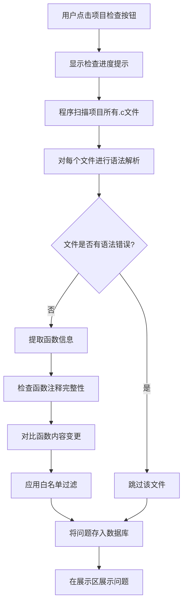
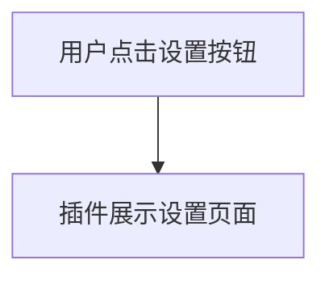
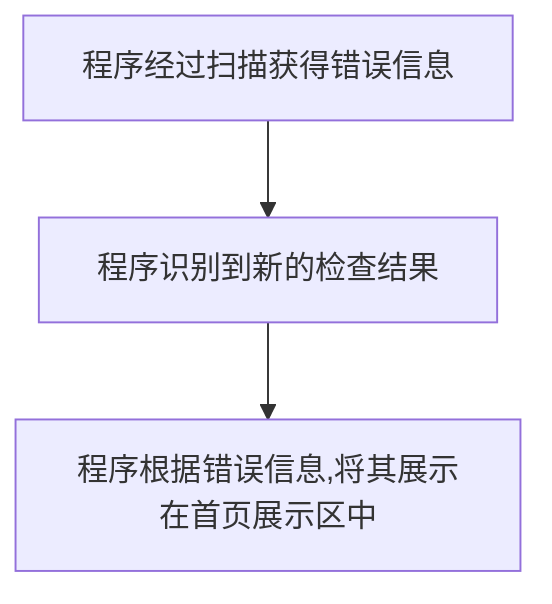
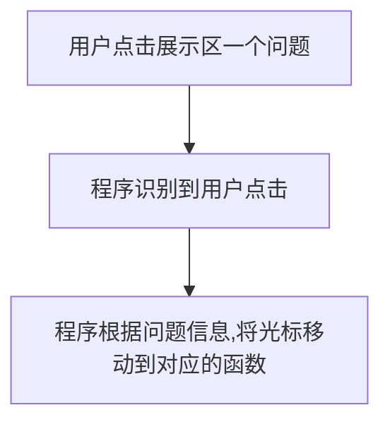
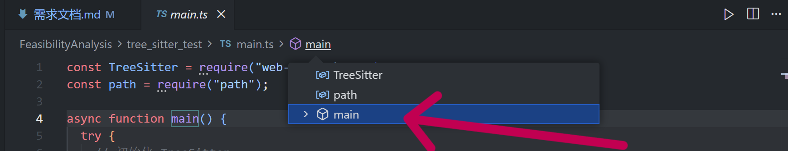
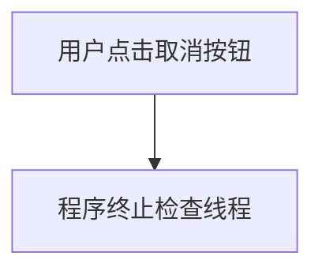
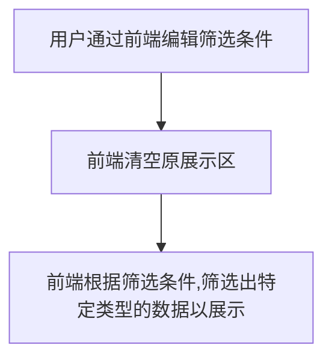
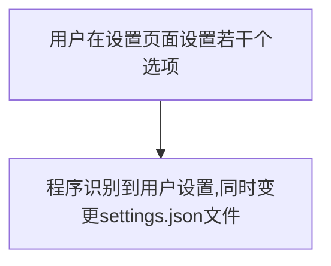
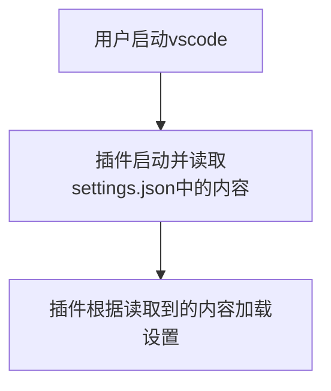
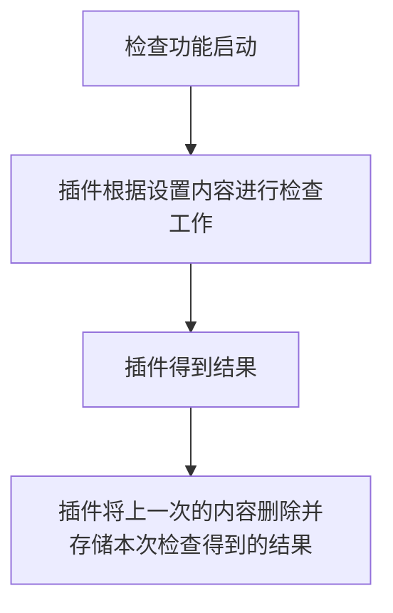

# 需求文档PRD 
## 前端：
该插件的界面可以以点击其在VSCode活动栏中的插件图标的方式打开。

预期包含以下界面：
### 首页界面：
**功能概述:**
手动启动项目检查的按钮,即检查按钮；跳转到设置界面的按钮。即设置按钮；用于显示可能存在的注释问题的区域,即展示区；
**功能1**：启动当前目录下项目的检查。用户点击"项目检查"的按钮以后,程序全盘扫描项目所有函数,并在"注释问题展示区"中展示可能存在的问题。注意：如果说某个文件存在语法问题相关的报错,则跳过这个文件的检查。程序检查内容为以下几点：
1. 功能流程：

2. 范围：.c文件,匿名函数不在其中
3. 问题类型与展示：
- 缺失：函数参数说明缺失；函数返回值说明缺失；函数体说明缺失
- 变更警告：函数内容变更警告
4. 边界与异常：
- 对于有语法错误的文件,在"输出区"提示该文件有语法错误,无法检查文件内容。
- 最多检查1000条错误信息。
- 检查过程中显示进度提示(如"正在检查文件: xxx.c")
- 如果检查时间过长(超过30秒),提示用户可以取消本次检查
- 如果文件过大(超过1MB),在输出框提示并跳过该文件
- 如果文件无读取权限,在输出框提示并跳过该文件
- 如果同时触发多次检查,取消上一次未完成的检查,执行最新的检查
5. 功能验收：
- 当项目中不存在符合条件的注释问题,在"输出框"提示"项目目前不存在相关问题噢",
- 程序能够正确识别有语法错误的文件,并在"输出框"提示"xxx文件存在语法错误,不执行检查"
- 程序能够正确发现三种类型的错误信息（函数参数说明缺失,函数返回值说明缺失,函数体说明缺失）,并在"输出框"提示
- 程序能够正确发现并展示函数内容变更警告,并在"输出框"提示
6. 注释格式规范
程序需要规定标准的注释格式,以便正确解析和检查。建议采用Doxygen风格的注释格式:

**标准注释格式:**
```cpp
/**
 * @brief 函数功能描述
 * @param param1 参数1的说明
 * @param param2 参数2的说明
 * @return 返回值的说明
 */
```

**检查规则:**
- 函数必须包含`@brief`或功能描述
- 每个参数必须包含对应的`@param`说明
- 有返回值的函数必须包含`@return`说明
- 如果注释格式符合规范但内容缺失,程序会标记为对应的缺失类型

**功能2**：跳转到设置界面。
1. 功能流程：

2. 范围：无
3. 边界与异常：无
4. 功能验收：
- 点击设置按钮以后,页面能够正确展示设置页面
**功能3**：显示可能存在的注释问题。专门规划出一个区域用于展示可能存在的注释问题。
1. 功能流程：

2. 范围：无
3. 边界与异常：
- 对于有语法错误的文件,在展示区提示该文件有语法错误,无法检查文件内容。
- 当项目中不存在符合条件的注释问题,应在"输出框"提示"项目目前不存在相关问题噢"
4. 问题展示内容
每一项问题展示的内容包括：问题类型,函数所在的文件相对路径,函数片段,函数注释的具体问题。
或许可以参考Cursor AI聊天界面的展示形式


**展示区功能:**
- 支持按问题类型筛选(参数缺失/返回值缺失/函数体缺失/内容变更警告/语法错误)
- 支持按文件路径筛选
- 支持搜索功能(可按函数名、文件路径搜索)
- 支持更新问题状态(右键菜单或按钮,将问题标记为已解决,同时后端需要更新后端数据库的内容)
5. 功能验收：
- 当项目中不存在符合条件的注释问题,展示区能正确展示空提示
- 程序能够正确识别"文件语法错误"的信息,并在展示区展示
- 程序能够正确识别三种类型的错误信息,并在展示区展示
- 程序能够正确识别展示函数内容变更警告,并在展示区展示
**功能4**：点击展示区中的问题后,在工作区自动跳转到问题对应的函数
1. 功能流程：

2. 范围：无
3. 边界与异常：
- 若函数(文件)已经被删除,则在输出框提示:"未找到函数(文件)!",同时弹出提示框(VSCode自带的,在右下角弹出的提示框)提示相同的信息.
4. 细节补充
根据观察,VSCode是有类似的功能的.比如:

本图中,点击main函数的按钮后,文件光标会自动移动到该函数名的开头位置.或许本项目功能可以在该功能的基础上完成.
5. 功能验收：
- 点击一个存在于工作区中的问题的时候,程序能够正确跳转到对应的函数
- 点击一个函数源文件已经被删除的问题的时候,程序能够正确在输出框输出提示,并正确弹出提示框
- 点击一个源文件存在单函数已经被删除的问题的时候,程序能够正确在输出框输出提示,并正确弹出提示框
**功能5**：取消当前正在进行中的检查工作
1. 功能流程：
```mermaid
flowchart TD
    A[用户点击取消按钮] --> B[程序终止检查工作] --> 
```
2. 边界与异常：无
3. 细节补充：检查工作由单独的线程执行，而取消功能的作用就是将暂停该线程的运行。当检查线程暂停以后，
4. 功能验收：
**功能6**：标记展示区中的问题为不同状态
1. 功能流程：

2. 边界与异常：
3. 细节补充
4. 功能验收：
**功能7**：设置筛选条件以在展示区中展示特定的问题类型
1. 功能流程：

2. 边界与异常：
3. 细节补充
4. 功能验收：


### 设置界面：
**功能概述:**
设置检查规则（文件白名单；函数白名单等）。

**功能1**：设置检查规则。可以设置的规则包括设置某些函数为白名单（默认main函数不检查注释问题）,设置某些文件为白名单,设置某些类型的函数为白名单（目前能想到的就只有,将不同的函数用返回值类型来区分）
1. 功能流程：

2. 范围：.c文件函数
3. 设置选项：
- 选项1:是否检查main函数(默认为否)
- 选项2:函数白名单列表(形式类似一颗树.叶子节点为函数签名,而其他节点都为文件名)
4. 边界与异常：
- 为了防止同名函数的干扰,所有的函数都需要`文件地址`和`函数签名`两重信息作为唯一标识
- 用户变更设置以后,若设置启动了自动检查,那么程序自动启动一次重新检查.若重启的自动检查还未结束,用户就再一次变更了设置,那么程序立即终止上一次自动检查,并重新启动一次新的自动检查.
5. 功能验收：
- 初始状态下,main函数被检查的选项应为**否**
- 用户设置一个新的,存在注释问题的函数进入(退出)白名单并重启检查后,展示区将不再(重新)显示该函数的信息
6. 细节补充:
对于设置选项,插件在每次启动的时候都加载设置选项进入缓存.每次设置内容变更的时候,插件重新读取设置内容(若用户是通过setting.json修改设置且修改后产生语法错误,那么插件不变更原设置)


## 后端：
后端功能：保存用户的设置内容；保存上一次启动检查功能后得到的结果；

**功能1**：设置内容被存储为一个json文件。程序读取设置就根据每个项目下的.vscode/settings.json文件来读取设置。

1. 功能流程：

2. 范围：无
3. 边界与异常：
- 如果settings.json不存在或者存在语法错误等问题,那么就使用原设置并在"输出框"输出异常信息("settings.json不存在"和"settings.json异常").程序刚启动时,若settings.json异常,则使用默认设置(白名单中除了main函数外全部勾选)
- 如果settings.json内容变更,程序应立即识别并读取新的设置配置,并在"输出框"中输出信息:"识别到settings.json文件产生变动,已经读取新的设置+具体设置内容"
- 当新的设置配置被加载的时候,需要更新前端设置页面对应的内容
4. 功能验收：
- 当settings.json不存在或者存在语法错误的时候,程序需要正确使用原设置(通过启动检查得知是否使用了原设置)并在"输出框"中输出正确的信息
- 当settings.json内容变更后,程序需要正确使用新的设置并在"输出框"中输出正确的信息

5. 配置文件结构(演示):
```json
{
  "doc-doctor.checkMainFunction": false,
  "doc-doctor.functionWhitelist": {
    "src/file1.c": ["function1", "function2"],
    "src/file2.c": ["function3"]
  },
  "doc-doctor.fileWhitelist": [
    "src/legacy/",
    "test/"
  ],
  "doc-doctor.returnTypeWhitelist": ["void"]
}
```

**功能2**：上一次启动检查功能后得到的结果就存储在一个SQLite的二进制文件里面。
1. 功能流程：

2. 范围：无
3. 边界与异常：无
4. 功能验收：
- 启动检查后,查询数据库,SQLite中应正确存储了相应的信息
5. 问题存储表格设计(演示)

| 字段名 | 数据类型 | 约束 | 说明 |
|--------|---------|------|------|
| id | INTEGER | PRIMARY KEY AUTOINCREMENT | 问题记录唯一标识 |
| problem_type | INTEGER | NOT NULL | 问题类型: `1参数缺失`/`2返回值缺失`/`3函数体缺失`/`4内容变更警告`/`5语法错误` |
| file_path | TEXT | NOT NULL | 函数所在文件的相对路径 |
| function_signature | TEXT |  | 函数签名 |
| function_name | TEXT | NOT NULL | 函数名 |
| line_number | INTEGER | DEFAULT 1 | 函数定义所在行号(用于跳转定位) |
| column_number | INTEGER | DEFAULT 1 | 函数名所在列号(用于跳转定位) |
| problem_description | TEXT | | 函数注释的具体问题描述 |
| function_snippet | TEXT | | 函数代码片段(用于展示) |
| check_timestamp | DATETIME | NOT NULL | 检查时间(格式: YYYY-MM-DD HH:MM:SS) |
| status | INTEGER | DEFAULT 0 | 问题状态: `0 normal`(正常),`1 ignored`(已忽略) |


## 扩展功能(只是想法,不一定会实现)

- 函数参数/函数体含义发生变化时,程序自动给出注释修正方案（函数参数/函数体含义发生变化时,程序如何配合AI来识别新的注释是否符合新的逻辑？）.如果要做这个功能,那么设置中应该有对应的选项进行函数API测试
- 可以通过在函数上方添加一行带特殊符号的注释代码来告诉程序,该函数不需要检查
- 可以在设置界面中启动自动检查.启动自动检查后,每一次用户变更内容后程序都会自动启动一次检查.(将其放在扩展功能的原因,是因为不确定该功能会不会导致启动检查的次数过多从而造成卡顿,同时还会存在其他细节上的问题.总之暂时先不完成)

# 功能提取

1. 前端
- 首页页面绘制模块(无输入,无输出.绘制首页页面)
- 设置页面绘制模块(无输入,无输出.绘制设置页面)
- 服务接口调用模块(输入为前端用户交互信息,无输出.接收用户的输入信息并调用相应的服务接口)

2. 服务层
- 文件语法解析模块(输入为一个需要被检查的文件的内容,输出为一个列表,包含该文件下所有函数的信息(函数路径,函数注释,函数签名,函数内容等))
- 函数检查模块(输入为一个需要被检查的函数,输出为该函数问题相关信息)
- 总检查模块(输入为所有需要被检查的文件的内容,输出为一个包含所有函数检查结果的列表.通过调用函数检查模块和文件语法解析模块实现)
- 函数白名单筛选模块(输入为白名单筛选规则,输出为所有不包含在白名单内的函数的相关信息)
- 任务取消模块(无输入,输出为是否取消成功的flag.启动该模块后会立即终止正在进行中的检查工作)
- 工作区跳转模块(输入为文件路径,函数所在行和函数名所在列.无输出.启动该模块后工作区光标跳转到指定的行和列)

3. 后端
- 数据库存储模块(输入函数问题相关信息,输出为是否存储成功的flag和消息)
- 数据库读取模块(无输入,输出为数据库中所有函数问题相关信息)
- 设置配置读取模块(输入为配置文件具体内容,无输出.设置功能实现的逻辑设想为,定义几个全局变量用于表示设置配置.设置更新的时候,只需要修改这几个全局变量的值即可)

# 线程分析

1. 主线程
监听用户启动检查功能.

2. 配置更新监听线程
监听用户更新设置配置.
- 如果用户的检查功能正在执行,而用户更新了配置,那么程序警告用户:"如果更新配置,则会取消当前正在进行的检查工作.是否继续?"

# 技术设计文档TD
- serena（记录大模型在工作区做了什么的一个项目）
# 启发

由于本次项目主要是为了设计一个插件,和软件有点相似,所以需求文档中着重强调的应该是该插件应该实现什么什么样的`功能`,而不是其他的东西,比如`线程分析`.线程分析的工作更适合由架构设计师负责.
架构设计的工作主要包含:线程分析和合理地将各个模块结合起来(其实线程分析就包含在其中)